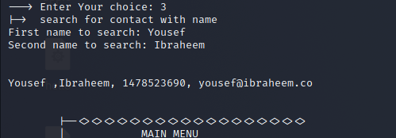

# Bash Scrip Contact program
This is the first project in the linux lab couarse at [Birzeit university](https://www.birzeit.edu/en/content/encs3130-linux-laboratory)

##### This project was done using the debian-based linux, [Kali Linux](https://www.kali.org/)

# Report
The idea of this project is to write a bash script that works like a contacts dictionary app
so the user can:
* add new contact to the file you choose at first 
* edit, update a certain contact
* delete a contact
* and search for contacts

# Sample Run

### File existance check

### Exit

## Menu Commands

----------------------------

#### Add Contact

----------------------------

#### List contacts based on first name

#### List contacts based on last name

----------------------------

#### Search for Contact

----------------------------

#### Edit Contact

----------------------------

#### Delete Contact

